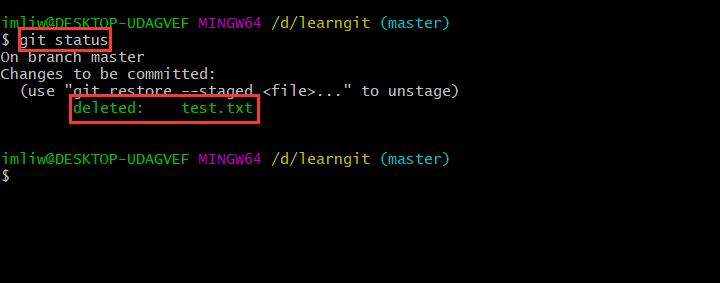
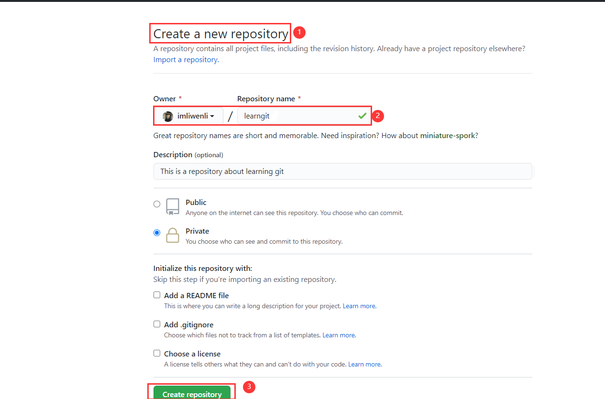
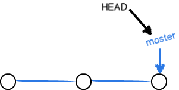

#git-study
##git简介
Git是目前世界上最先进的分布式版本控制系统
##集中式和分布式
集中式。集中式版本控制系统的版本库是集中存放在中央服务器的，而工作的时候用的都是自己的电脑，所以要先从中央服务器获取最新的版本。缺点：需要联网才能工作！


分布式。分布式版本控制系统根本没有中央服务器，每个人的电脑上都是一个完整的版本库，你在工作的时候就不需要联网，因为版本库就在你自己的电脑上。

##安装git
centos
```
$ sudo dnf install git-all
```
ubuntu
```
$ sudo apt install git-all
```
window
```
只需一路下一步
```
##环境配置
1.配置及文件位置
```
$ git config --list --show-origin
```


2.列出配置
```
$ git config --list
```


3.配置用户信息
```
$ git config --global user.name "imliwenli"
$ git config --global user.email "im.liwenli@gmail.com"
```
ps：命令执行后会在更目录出现一个.gitconfig文件(~/.gitconfig)


4.注意事项

如果使用了 --global 选项，那么该命令只需要运行一次，因为之后无论你在该系统上做任何事情， Git 都会使用那些信息


##获取帮助
1.获取全部帮助
```
git --help
```


2.获取特定指令帮助
```
git init --help
```


##创建git仓库
仓库，英文名repository，你可以简单理解成一个目录，这个目录里面的所有文件都可以被Git管理起来，
每个文件的修改、删除，Git都能跟踪，以便任何时刻都可以追踪历史，或者在将来某个时刻可以还原。

1.切换到需要初始化为git仓库的目录执行命令git init
```
$ git init
```


2.克隆现有的仓库git clone
```
$ git clone git@github.com:imliwenli/learngit.git
```


##添加文件到Git仓库
1.git仓库里面创建文件


2.使用git status 查看git仓库中的当前状态
```
$ git status
```


2.使用命令git add告诉Git，把文件添加到仓库
```
$ git add .
```


3.使用git commit -m "提交备注"，把文件提交到仓库
```
$ git commit -m "提交备注"
```


##git的工作原理
###准备
工作区


版本库


暂存区


head


本地仓库(三个组件构成)
workspace,stage,head

远程仓库


工作原理


###实操一遍流程！

1.在git工作区新建两个文件(也就是learngit目录，当然不包括.git目录)


2.查看添加新文件后的当前状态
```
$ git status
```


3.使用git add
```
$ git add LICENSE readme.txt
```
或者
```
$ git add .
```


4.查看使用git add 后的当前状态
* git add命令实际上就是把要提交的所有修改放到暂存区（Stage）
```
$ git status
```


5.修改文件内容


6.查看修改文件后的当前状态
```
$ git status
```


7.使用git对修改后的文件进行提交
```
$ git add LICENSE readme.txt
```
或者
```
$ git add .
```


8.查看提交后的当前状态
```
$ git status
```


9.使用git commit - m
```
$ git commit -m "git commit memo"

```


10.查看git commit -m ""的当前状态
```
$ git status

```


##撤销操作
* 修改了文件但是还没有使用git add命令
1.修改文件


2.查看当前状态
```
$ git status
```


3.撤销(忽略)
```
$ git restore readme.txt
```


4.查看当前状态
```
$ git status
```


5.查看readme.txt文件是否撤销(忽略)


* 修改了文件并且使用了git add 但是没有使用git commit

1.修改并使用git add命令

2.查看当前状态
```
git status
```


3.撤销(unstage)
```
$ git restore --staged readme.txt
```

4.查看当前状态
```
$ git status
```


5.继续忽略
```
$ git restore readme.txt
```


6.查看当前状态
```
git status
```


* 修改了文件并且使用git add 和git commit命令

##删除文件
* 准备(新增一个文件并让git托管)


* 删除某个文件

1.工作空间删除文件
```
$ rm test.txt
```


2.查看当前状态
```
$ git status
```


3.使用git rm 命令删除文件
```
$ git rm test.txt
```


4.查看当前状态
```
git status

```


5.查看当前工作空间是否删除

```
$ ls
```


* 误删

1.工作空间中删除文件
```
$ rm test.txt
```


2.查看当前状态
```
$ git status
```


3.由于是误删，我们希望找回test.txt 文件
```
$ git restore test.txt
```


4.查看工作空间是否找回删除的文件
```
$ ls
```


##版本日志
1.git log 
```
$ git log
```


2.git log --pretty=oneline
```
$ git log --pretty=oneline

```


3.git log --graph --pretty=oneline

```
$ git log --graph --pretty=oneline

```


4.git log --graph --pretty=oneline --abbrev-commit

5.git reflog用来记录你的每一次命令
```
$ git reflog
```


##版本回退
* 回退到上一次的commit版本
1.查看当前commit日志
````
$ git log --pretty=oneline
````


2.从当前版本回退到上一个版本git reset --hard HEAD^
```
Git的版本回退速度非常快，因为Git在内部有个指向当前版本的HEAD指针，当你回退版本的时候，Git仅仅是把HEAD从指向update readme.txt v3：

┌────┐
│HEAD│
└────┘
   │
   └──> ○ update readme.txt v4
        │
        ○ update readme.txt v3
        │
        ○ update readme.txt v2
        │
        ○ update readme.txt v1
        │
        ○ test delete file
        │
        ○ git commit memo
        │
        ○ 提交备注

改为指向：


┌────┐
│HEAD│
└────┘
   │
   │    ○ update readme.txt v4
   │    │
   └──> ○ update readme.txt v3
        │
        ○ update readme.txt v2
        │
        ○ update readme.txt v1
        │
        ○ test delete file
        │
        ○ git commit memo
        │
        ○ 提交备注
        
```
```
$ git reset --hard HEAD^
```


* 回退到任意的commit版本git reset --hard commit_id

1.查看当前commit日志
````
$ git log --pretty=oneline
````


2.回退到commit_id为"073226401c5a7a33a5190d5f57745d23b7c4a76e"的commit版本
* commit_id不需要全部写出来(我们这里取0732264！)，只需要写出前几位就行，git会去帮我们找！！！
```
$ git reset --hard 0732264
```


##远程仓库
* github添加公密

1.创建SSH Key
```
$ ssh-keygen -t rsa -C "im.liwenli@gmail.com"
```
2.一路回车

3.出现~/.ssh目录


4.github添加公密


* 添加远程库

1.创建远程仓库


2.在本地的learngit仓库下运行命令(origin是远程仓库的默认名字，可以修改！！)
```
$ git remote add origin git@github.com:imliwenli/learngit.git
```

3.将本地的仓库推送到远程仓库
* 加上了-u参数，Git不但会把本地的master分支内容推送的远程新的master分支，还会把本地的master分支和远程的master分支关联起来，在以后的推送或者拉取时就可以简化命令
```
$ git push -u origin master
```

4.以后push可以直接使用$ git push origin master，不需要再加上-u参数了！


5.从远程仓库克隆项目到本地

```
$ git clone git@github.com:imliwenli/learngit.git
```

##分支管理
###创建分支

* 分支理论
1.master

每次提交，Git都把它们串成一条时间线，这条时间线就是一个分支。
截止到目前，只有一条时间线，在Git里这个分支叫主分支，即master分支。
HEAD严格来说不是指向提交，而是指向master，master才是指向提交的，所以HEAD指向的就是当前分支。
一开始的时候，master分支是一条线，Git用master指向最新的提交，
再用HEAD指向master，就能确定当前分支，以及当前分支的提交点。
每次提交，master分支都会向前移动一步，这样，随着你不断提交，master分支的线也越来越长。

2.创建新的分支

当我们创建新的分支，例如新分支叫做dev的时侯，Git新建了一个指针叫dev，指向master相同的提交，
再把HEAD指向dev，就表示当前分支在dev上。Git创建一个分支很快，因为除了增加一个dev指针，改改HEAD的指向，
工作区的文件都没有任何变化！


3.再次提交

从现在开始，对工作区的修改和提交就是针对dev分支了，
比如新提交一次后，dev指针往前移动一步，而master指针不变。


4.合并分支

假如我们在dev上的工作完成了，就可以把dev合并到master上。
Git怎么合并呢？最简单的方法，就是直接把master指向dev的当前提交，就完成了合并。
Git合并分支也很快！就改改指针，工作区内容也不变！


5.删除分支

合并完分支后，甚至可以删除dev分支。
删除dev分支就是把dev指针给删掉，删掉后dev分支后，我们就剩下了一条master分支。


* 分支实战
1.查看当前分支
```
$ git branch
```


2.创建分支
```
$ git branch dev
```


3.创建分支后查看分支情况
```
$ git branch
```


4.切换分支
```
$ git switch dev

```


5.在dev分支上工作(修改readme.txt)


6.提交dev分支修改
```
$ git add readme.txt
```


```
$ git commit -m "update in dev fork"
```


7.切换回master分支
```
$ git switch master

$ cat readme.txt
```


8.master分支合并dev分支
* 我们把dev分支的工作成果合并到master分支上
```
$ git merge dev
```


9.查看master分支的readme.txt是否和dev分支一致


10.删除dev分支
* 当我们不需要dev分支的时候就可以删除掉dev分支了，
因为我们已经把dev分支合并到了master分支上了。
```
$ git branch -d dev
```


11.创建并切换到dev分支
```
$ git switch -c dev
```


###解决冲突
* 合并分支的时候并不是总是能够进行快速的合并，有时候我们会遇到冲突
1.创建并切换一个新的feature分支
```
$ git switch -c feature
```


2.在feature分支上修改readme.txt


3.在feature分支上提交readme.txt修改
```
$ git add readme.txt

$ git commit -m "feature update"
```


4.切换到master分支
```
$ git switch master
```


5.master分支修改readme.txt


6.master分支提交readme.txt的修改
```
$ git add readme.txt

$ git commit -m "master update"
```


7.master分支合并feature分支内容
* 现在master分支和feature分支都对readme.txt分支进行了修改，合并feature分支的时候会发生冲突，不能实现快速合并！！
```
$ git merge feature

```
* master分支和feature分支各自都分别有新的提交


8.查看当前状态
```
$ git status
```


9.查看发生冲突的文件


10.解决冲突(修改readme.txt内容)
```
$ vim readme.txt
```


11.提交修改冲突
```
$ git add readme.txt
```


10.再次合并feature分支
```
$ git merge feature
```
* 现在，master分支和feature1分支变成了下图所示


11.查看合并记录
```
$ git log --graph --pretty=oneline --abbrev-commit
```


12.合并完feature分支后就可以删除feature分支了(当然也可以不删除，留着！)
```
$ git branch -d feature
```
13.总结
* 当Git无法自动合并分支时，就必须首先解决冲突。解决冲突后，再提交，合并完成。

###标签管理
####简介
发布一个版本时，我们通常先在版本库中打一个标签（tag），这样，就唯一确定了打标签时刻的版本。
将来无论什么时候，取某个标签的版本，就是把那个打标签的时刻的历史版本取出来。所以，标签也是版本库的一个快照。
Git的标签虽然是版本库的快照，但其实它就是指向某个commit的指针（跟分支很像对不对？但是分支可以移动，标签不能移动），
所以创建和删除标签都是瞬间完成的。
####创建标签
1.创建标签
```
$ git tag v1.0
```

2.查看标签
```
$ git tag
```


3.查看tag v1.0
````
$ git show v1.0
````


####操作标签

1.删除标签(标签打错了)
* 未推送到远程库(直接删除本地仓库的标签即可)
```
$ git tag -d v1.0
```
2.推送标签到远程库
```
$ git push origin v1.0
```
3.推送全部尚未推送到远程的本地标签
```
$ git push origin --tags
```
4.删除标签
* 已经推送到远程库(先从本地删除标签,然后从远程删除)
```
$ git tag -d v1.0
```
```
git push origin :refs/tags/v1.0
```

##远程仓库
###github
* 基本使用
1.创建远程仓库
* 项目名称最好与本地库保持一致

2.关联本地仓库
```
$ git remote add github git@github.com:imliwenli/learngit.git
```


3.本地仓库push到github远程库
```
git remote add origin git@github.com:imliwenli/learngit.git
```
```
git remote add github git@github.com:imliwenli/learngit.git
```


###gitee
1.创建远程库
* 项目名称最好与本地库保持一致


2.本地仓库关联远程仓库
* 因为我们已经关联了github并且名字也是origin，所以再次关联gitee的时候会报错！

```
先删除origin这个远程仓库
$ git remote rm origin
```

```
git remote add gitee https://gitee.com/imliwenli/learngit.git
```

3.查看远程库
```
$ git remote -v
```


###推送到远程仓库
将master主分支推送到github
```
git push github master
```
将master主分支推送到gitee
```
git push gitee master
```
```
我们的本地库就可以同时与多个远程库互相同步

┌─────────┐ ┌─────────┐
│ GitHub  │ │  Gitee  │
└─────────┘ └─────────┘
     ▲           ▲
     └─────┬─────┘
           │
    ┌─────────────┐
    │ Local Repo  │
    └─────────────┘
```

##多人协作
###fork
1.fork开源项目到自己的远程仓库(github/gitee)
* 点击fork就在自己的账号下克隆了一个bootstrap仓库

2.从自己的远程仓库克隆到本地仓库(电脑工作空间)
* 一定要从自己的账号下clone仓库，这样你才能推送修改。
如果从bootstrap的作者的仓库地址git@github.com:twbs/bootstrap.git克隆，
因为没有权限，你将不能推送修改

```
git clone git@github.com:imliwenli/bootstrap.git
```
```
┌─ GitHub ──────────────────────────────────────┐
│                                               │
│ ┌─────────────────┐     ┌───────────────────┐ │
│ │ twbs/bootstrap  │────>│imliwenli/bootstrap│ │
│ └─────────────────┘     └───────────────────┘ │
│                                  ▲          
└──────────────────────────────────┼────────────┘
                                   ▼
                          ┌─────────────────┐
                          │ local/bootstrap │
                          └─────────────────┘
```

###push
1.克隆远程仓库

多人协作时，大家都会往master和dev分支上推送各自的修改。推送分支，就是把该分支上的所有本地提交推送到远程库。
模拟一个你的小伙伴，可以在另一台电脑（注意要把SSH Key添加到GitHub/gitee）或者同一台电脑的另一个目录下克隆。

```
$ git clone git@github.com:imliwenli/learngit.git
Cloning into 'learngit'...
remote: Counting objects: 40, done.
remote: Compressing objects: 100% (21/21), done.
remote: Total 40 (delta 14), reused 40 (delta 14), pack-reused 0
Receiving objects: 100% (40/40), done.
Resolving deltas: 100% (14/14), done.
```

2.从远程库clone时，默认情况下只能看到本地的master分支
```
$ git branch
* master
```
3.本地创建dev分支

要在dev分支上开发，就必须创建远程origin的dev分支到本地，于是他用这个命令创建本地dev分支。
```
//查阅是否正确
$ git switch -b dev origin/dev 
```

4.在dev分支上修改readme.txt并推送(在你push到远程仓库之前，别人已经push过了，会推送失败！！)
```
$ git add .

$ git commit -m "dev update"
[dev 7a5e5dd] modified readme.txt
 1 file changed, 1 insertion(+)

$ git push origin dev
To github.com:michaelliao/learngit.git
 ! [rejected]        dev -> dev (non-fast-forward)
error: failed to push some refs to 'git@github.com:imliwenli/learngit.git'
hint: Updates were rejected because the tip of your current branch is behind
hint: its remote counterpart. Integrate the remote changes (e.g.
hint: 'git pull ...') before pushing again.
hint: See the 'Note about fast-forwards' in 'git push --help' for details.
```

推送失败，则因为远程分支比你的本地更新，解决办法也很简单，Git已经提示我们，
先用git pull把最新的提交从origin/master抓下来，再推送。

5.拉取最新提交
```
$ git pull
There is no tracking information for the current branch.
Please specify which branch you want to merge with.
See git-pull(1) for details.

    git pull <remote> <branch>

If you wish to set tracking information for this branch you can do so with:

    git branch --set-upstream-to=origin/<branch> dev
```
git pull也失败了，原因是没有指定本地dev分支与远程origin/dev分支的链接，根据提示，设置dev和origin/dev的链接

6.设置本地仓库dev和远程仓库origin/dev链接
```
$ git branch --set-upstream-to=origin/dev dev
Branch 'dev' set up to track remote branch 'dev' from 'origin'.
```
7.再git pull
```
$ git pull
Auto-merging readme.txt
CONFLICT (add/add): Merge conflict in readme.txt
Automatic merge failed; fix conflicts and then commit the result.
```
这回git pull成功，但是合并有冲突，需要手动解决，解决的方法和分支管理中的解决冲突完全一样。

8.解决冲突，再提交，再push
```
$ git commit -m "fix conflict"
[dev 57c53ab] fix conflict

$ git push origin dev
Counting objects: 6, done.
Delta compression using up to 4 threads.
Compressing objects: 100% (4/4), done.
Writing objects: 100% (6/6), 621 bytes | 621.00 KiB/s, done.
Total 6 (delta 0), reused 0 (delta 0)
To github.com:michaelliao/learngit.git
   7a5e5dd..57c53ab  dev -> dev
```

9.总结
```

多人协作的工作模式通常是这样：
首先，可以试图用git push origin <branch-name>推送自己的修改；

如果推送失败，则因为远程分支比你的本地更新，需要先用git pull试图合并；

如果合并有冲突，则解决冲突，并在本地提交；

没有冲突或者解决掉冲突后，再用git push origin <branch-name>推送就能成功！

如果git pull提示no tracking information，则说明本地分支和远程分支的链接关系没有创建，用命令git branch --set-upstream-to <branch-name> origin/<branch-name>。
```